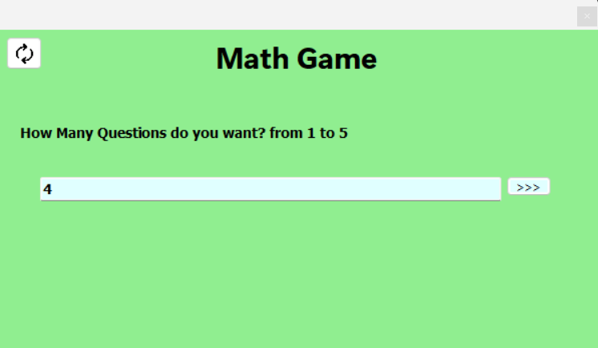
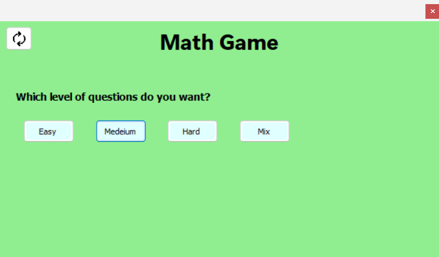
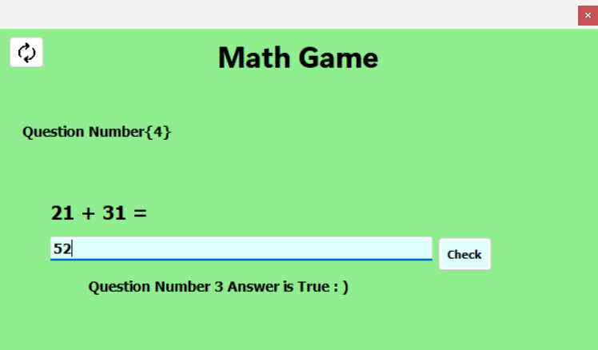

# Math Game Application 🧠🔢

An interactive educational C# Windows Forms application designed to test and improve basic arithmetic skills through customizable quizzes.

## 📸 Screenshots

| Setup Quiz | Select Difficulty / Operation | Play & Check Answer |
| :---: | :---: | :---: |
|  |  |  |

## 🚀 Features

* **Custom Quiz Length**: Set the number of math questions per session (1 to 5 questions).
* **Multiple Difficulty Levels**:
  * **Easy**: Single-digit numbers (0–10).
  * **Medium**: Two-digit numbers (10–50).
  * **Hard**: Complex numbers (50–100).
  * **Mix**: Randomized difficulty per question.
* **Operation Types**: Support for Addition (+), Subtraction (-), Multiplication (*), Division (/), or a Mixed mode.
* **Real-Time Evaluation**: Instant feedback showing correct/wrong answers and detailed performance summary upon quiz completion.
* **Input Validation & Exception Handling**: KeyPress filtering and ErrorProvider logic to ensure valid numeric inputs.

## 🛠️ Built With

* **Language**: C#
* **Framework**: .NET / Windows Forms
* **IDE**: Visual Studio

## 🖥️ How to Run

1. Clone the repository:
   ```bash
   git clone [https://github.com/Muhammad-sadaka/MathGame.git](https://github.com/Muhammad-sadaka/MathGame.git)

